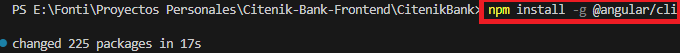
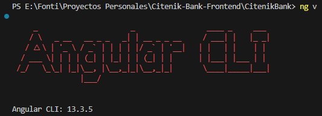
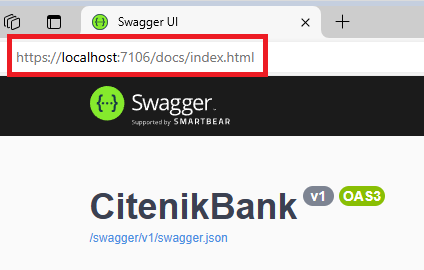
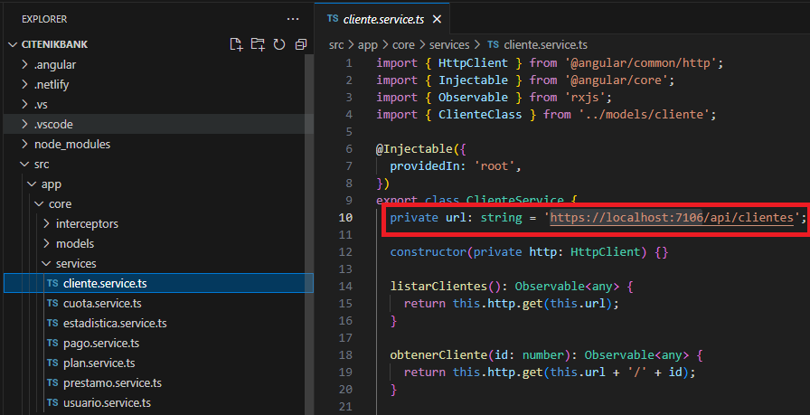

# <Citenik-Bank-Frontend>

## Índice

- [Instalación](#instalación)
- [Uso](#uso)
- [Créditos](#créditos)
- [Licencia](#licencia)
- [Insignias](#insignias)
- [Funciones](#funciones)

## Descripción

CitenikBank es un proyecto de formación profesional desarrollado para una pasantía laboral que busca **simular el ejercició de una plataforma de negocios virtual** 
como lo es un banco. Para esto, se desarrollo un **sistema de gestión capaz de permitir la creación, simulación y otorgamiento de prestamos en línea** a clientes previamente registrados en la plataforma. 

Dentro de este repositorio encontraremos todo lo relacionado con el **frontend** de CitenikBank, el cual fue desarrollado haciendo uso de **Angular 13.3.5**.

## Funciones

Este proyecto contiene las diferentes vistas posibles de acceder dentro de la página de CitenikBank, donde podremos observar:
* Registro, Modificación y Baja de Clientes.
* Registro, Modificación y Baja de Prestamos.
* Otorgamiento de Prestamos a Clientes registrados previamente.
* Simulación de Cuotas a pagar.
* Pago virtual de Cuota.

## Instalación

Para poder hacer uso del sistema será necesario contar con lo siguiente:

* Visual Studio Code: https://code.visualstudio.com/download
* Angular 13.3.5: guía en la sección de [uso](#uso)

## Uso

Para poder hacer uso del proyecto, sera necesario contar con la versión 13.3.5 del cliente de Angular. Para elló ejecutaremos el siguiente comando en nuestra terminal 

>  npm install -g @angular/cli

  

Para poder observar si la versión instalada de Angular es la correcta podemos ejecutar el comando: 

> ng v

  

Ya instalado Angular, será necesario también ejecutar el siguiente comando para poder descargar todas aquellas dependencias necesarias para la ejecución del proyecto:

> npm install

Completados los pasos anteriores, lo único por hacer es levantar el proyecto, para lo cual utilizamos el siguiente comando:

> ng serve -o

> [!NOTE]
> Existe la posibilidad de que el puerto desde donde queremos consumir las API's no sea el mismo que el que se encuentra publicado en los archivos services, de las respectivas vistas. Para verificar esto, deberemos consultar en Swagger, en que puerto se encuentran corriendo el proyecto de backend. 

  

Ya que sabemos el puerto, deberemos dirigirnos a la carpeta app > core > services y dentro de cada uno de los servicios verificar que el puerto sea el correcto.

  

## Crédito

Este proyecto fue desarrollado por: 
* Karen Yamila Cruz 
* Ramiro Carreño
* Fontal Santiago

Juntos, llevamos a cabo varios de los roles los que uno se encuentra comunmente dentro del ambito de desarrollo de software. De esta manera, podemos decir que realizamos
desde el lado técnico realizamos tareas de **desarrollador de software**, como así también de **gestor de base de datos**. A su vez, realizamos pruebas, observando el trabajo que debería
desarrollar un **analista de calidad**. Por otro lado, también realizamos algunas tareas de gestión, en donde tuvimos que hacer un análisis y refinamiento de los requerimientos solicitados por el cliente. Es aquí donde desempeñamos el papel de **analistas funcionales**

## Licencia

MIT License

Copyright (c) [2024] [CitenikBank]

Permission is hereby granted, free of charge, to any person obtaining a copy
of this software and associated documentation files (the "Software"), to deal
in the Software without restriction, including without limitation the rights
to use, copy, modify, merge, publish, distribute, sublicense, and/or sell
copies of the Software, and to permit persons to whom the Software is
furnished to do so, subject to the following conditions:

The above copyright notice and this permission notice shall be included in all
copies or substantial portions of the Software.

THE SOFTWARE IS PROVIDED "AS IS", WITHOUT WARRANTY OF ANY KIND, EXPRESS OR
IMPLIED, INCLUDING BUT NOT LIMITED TO THE WARRANTIES OF MERCHANTABILITY,
FITNESS FOR A PARTICULAR PURPOSE AND NONINFRINGEMENT. IN NO EVENT SHALL THE
AUTHORS OR COPYRIGHT HOLDERS BE LIABLE FOR ANY CLAIM, DAMAGES OR OTHER
LIABILITY, WHETHER IN AN ACTION OF CONTRACT, TORT OR OTHERWISE, ARISING FROM,
OUT OF OR IN CONNECTION WITH THE SOFTWARE OR THE USE OR OTHER DEALINGS IN THE
SOFTWARE.

---

## Insignias

